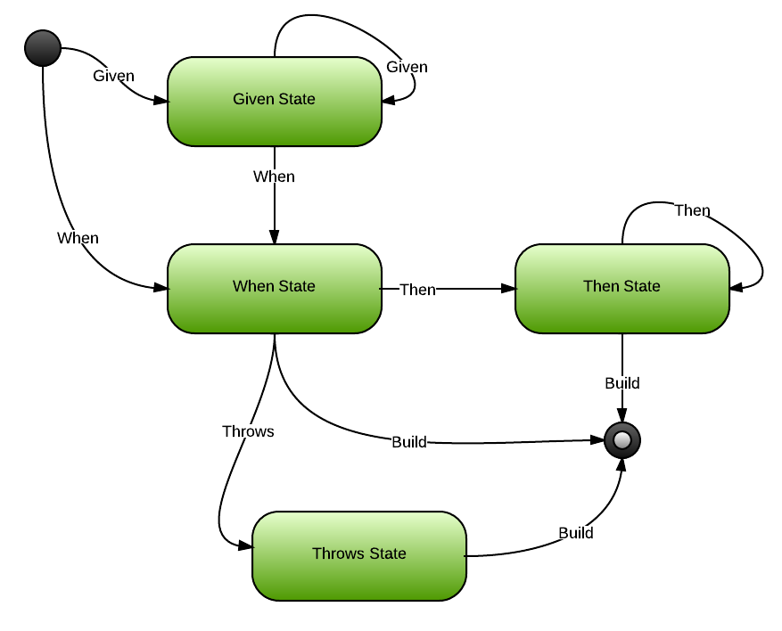

AggregateSource Testing
=======================

Helps you write test specifications, using a simple, codified statechart and a fluent syntax.



This fluent syntax comes in two flavors (for now). One is targetted at writing collaborating aggregate test specifications, the other at writing single aggregate test specifications. This begs the question: "Which one should I use?". The simple answer is: "Whichever one is more appropriate for the situation.". "What kind of shitty answer is that?", you may wonder. If you have a "command messaging" layer sitting on top of your aggregates, I would urge you to use the collaborating approach. If you feel that the test permutations are getting too high, or that testing closer to the aggregate surface feels more natural, or you simply don't have any command messages (e.g. disconnected client or client-side domain model), you can use the single aggregate test specifications.

#### Testing Collaborating Aggregates

```csharp
new Scenario().
  Given(RoleId,
    new AddedRole(RoleId, RoleName),
    new AddedPermissionToRole(RoleId, PermissionId),
    new RolePermissionDenied(RoleId, PermissionId)).
  When(new DenyRolePermission(RoleId, PermissionId)).
  AssertNothingHappened();

// or

new Scenario().
  Given(RoleId,
    new AddedRole(RoleId, RoleName)).
  When(new DenyRolePermission(RoleId, UnknownPermissionId)).
  AssertThrows(new Exception("Yo bro, the permission is not known to me."));

// or

new Scenario().
  Given(RoleId,
    new AddedRole(RoleId, RoleName)).
  When(new AddPermissionToRole(RoleId, PermissionId)).
  Then(RoleId,
    new AddedPermissionToRole(RoleId, PermissionId)).
  Assert();
```

#### Testing Single Aggregate

Testing aggregate (root entity) methods comes in 4 variations: ```constructor```, ```factory```, ```command``` and ```query```. Constructor invocations give birth to new aggregates. Factory methods on aggregates give birth to new aggregates. This is similar in spirit to what is described [here](http://www.udidahan.com/2009/06/29/dont-create-aggregate-roots/ "Don't create aggregate roots"). Command methods change the state of the aggregate but do not return a value. Query methods return a value but do not change the observable state of the aggregate. Principles that reenforce this way of thinking and testing are [CQS](http://martinfowler.com/bliki/CommandQuerySeparation.html "Command and query separation") and [TDA](http://pragprog.com/articles/tell-dont-ask "Tell, don't ask").

```csharp

// Constructor example
new ConstructorScenarioFor<Concert>(() => Concert.Plan(ConcertId, Capacity)).
  Then(
    ConcertEvents.Planned(ConcertId, Capacity).
  Assert();

// Factory example
new FactoryScenarioFor<Concert>(Concert.Factory).
  Given(
    ConcertEvents.Planned(ConcertId)).
  When(sut => sut.StartTicketSale(TicketSaleId, DateTimeOffset.UtcNow.Date)).
  Then(
    TicketSaleEvents.Started(TicketSaleId, ConcertId, DateTimeOffset.UtcNow.Date, 100)).
  Assert();

// Command example
new CommandScenarioFor<Concert>(Concert.Factory).
  Given(
    ConcertEvents.Planned(ConcertId)).
  When(sut => sut.Cancel("Lead singer OD'ed.")).
  Then(
    ConcertEvents.Cancelled(ConcertId, "Lead singer OD'ed.")).
  Assert();

// Query example
new QueryScenarioFor<TicketSale>(TicketSale.Factory).
  Given(
    TicketSaleEvents.Started(TicketSaleId, ConcertId, DateTimeOffset.UtcNow.Date, 100)).
  When(sut => sut.GetAvailability()).
  Then(new SeatCount(100)).
  Assert();

```
#### Asserts

Mind that the Assert* methods are **not** in the box (applies to collaborating aggregates only). It's an integration point between the test specifications and your testing framework of choice. Leverage its asserts to execute the specification.

Looking for an example? Head on over to the Testing folder of the [SampleSource](../SampleSource/ "Sample source") project.
The principles discussed here are easily applicable to other frameworks and libraries. Feel free to steal ...
